# Gore Head: a procedural human head with live, layered gore (Blender 5.x)

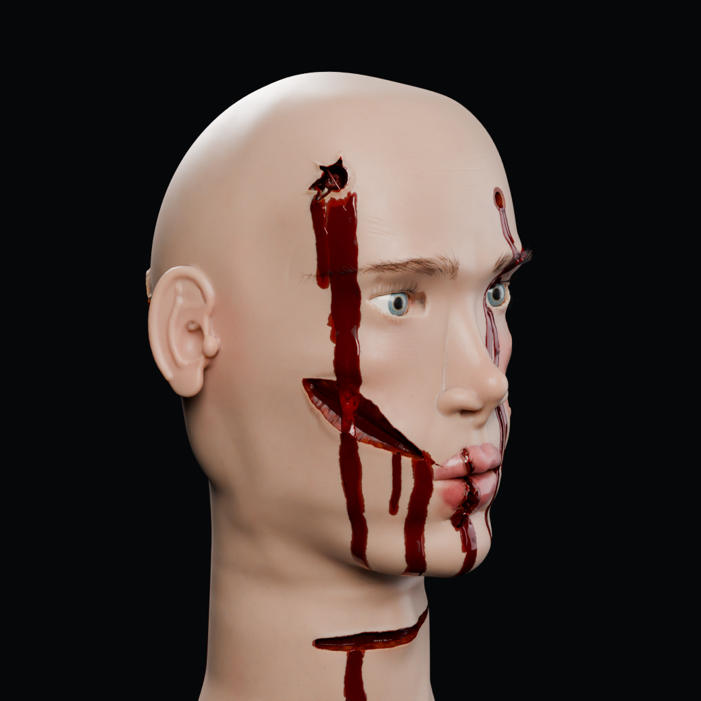

A realistic adult male head built **entirely from Python code**, with a layered anatomy inside it and a live
geometry-nodes gore system. You place wounds as empties: bullet entry, bullet exit, knife slash, blunt blow,
burn and blast. They cut real holes and walls through skin, fat, muscle, skull and brain, and blood runs out of
them over time. This head becomes the head of the full-body gore simulator (`../gore_body/`, `../../gore-game/`).

**Nothing is downloaded.** No meshes, textures, HDRIs, add-ons or scripts from the internet are used.
Every shape is a signed-distance field meshed in numpy. Every material is a Blender procedural node tree.
Every wound is geometry nodes. The research behind the wound shapes and blood behaviour is in
`../../gore-game/docs/` (REALISM_BIBLE.md, research/01-02, REFERENCE_NOTES.md).

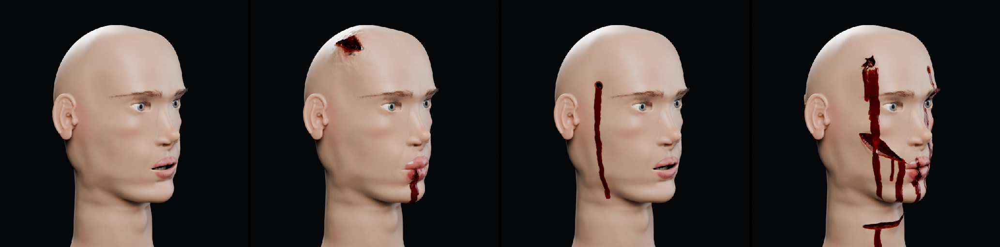
*Left to right: intact, `blunt` preset, `gunshot` preset, `carnage` preset (three-quarter camera).*

---

## What is inside

| Object | What it is |
|---|---|
| `GH_Skin` | outer skin (~170k verts): lidded eyes, nose with nostrils, parted lips (7.4 mm), ears, neck cut at z = -0.20 m |
| `GH_Muscle` | soft-tissue / muscle layer under the skin (airway carved through the neck) |
| `GH_Skull` | cranium with a 6.5 mm vault and inner table, orbits, nasal cavity, frontal and maxillary sinuses, zygomatic arches, palate |
| `GH_Jaw` | mandible |
| `GH_Cervical` | C1-T1 vertebrae with a spinal canal (not a gore layer) |
| `GH_Brain` | hemispheres with gyri/sulci, cerebellum, brain stem continuing as the spinal cord |
| `GH_Eye_L`, `GH_Eye_R` | eyeballs (cornea bulge, iris, pupil, clear vitreous) |
| `GH_Teeth_Upper`, `GH_Teeth_Lower` | 14 teeth each, one mesh island per tooth |
| `GH_Gums`, `GH_Tongue`, `GH_MouthCavity` | mouth interior |
| `GH_Eyebrows`, `GH_Eyelashes` | hair curves that stay on the skin surface |
| `GH_Controls` | an empty holding every global slider (see below) |

Units are metres, Z is up, the face looks toward -Y, and the character's left is +X. The origin is the midpoint
between the ear canals. `CONTRACT.md` has every name, landmark, attribute and rule.

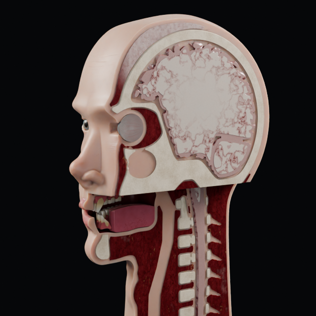

---

## Using `gore_head.blend` in Blender 5.1

1. Open `gore_head.blend`. It opens on the **gunshot** preset: an entry at the right temple, an exit at the back
   left. The timeline is animated (see *Animation* below).
2. In the Outliner, open the collection **`GH_Hits`**. It has one child collection per wound type. Each wound is an
   **empty** in one of them:

   | Collection | Wound |
   |---|---|
   | `GH_Hits_Bullet` | bullet entrance: a small hole (scalp ~7.5 mm, face ~7 mm, neck ~5 mm) with an abrasion collar. The skull hole is larger and bevelled inward. Brain track. Soot, stippling or a contact tear by muzzle distance |
   | `GH_Hits_Exit` | bullet exit: 10-30 mm, circular / stellate / irregular / slit / crescent, everted, bone chips, herniated brain, no collar |
   | `GH_Hits_Slash` | knife cut along the empty's local X. Gape depends on the angle to the skin tension lines. V-shaped walls. Never cuts bone |
   | `GH_Hits_Blunt` | blunt blow: split skin over bone, crushed margins, swelling and a bruise that develop with `wound_age`, depressed skull fracture when deep, knocked-out teeth near the mouth. Several blows close together **add up** into a crushed area |
   | `GH_Hits_Burn` | burn: red band, blistered partial thickness, leathery full thickness, charred core that splits |
   | `GH_Hits_Blast` | explosive in the mouth or contact shotgun: shredded crater of the lower-mid face, broken-off mandible segment with its teeth, soot |

3. **Select an empty and move / rotate / scale it.** The wound updates live. Each change re-evaluates every layer,
   which takes a few seconds on a CPU (see *Performance*).
   - **Location** = the impact point. It only has to be near the skin: the system finds the surface. An empty more
     than ~3.5 cm from any layer, or with scale X ~0, is ignored.
   - **Rotation**: the empty's local **-Z** is the direction the damage travels into the head (the bullet path).
     Its local **X** is the slash direction.
   - **Scale X** = size (1.0 = the normal size for that wound type).
   - **Scale Y** = elongation (1.0 = round; a slash's length comes from this).
     **For bullets, scale Y is the muzzle distance in metres** instead: 1.0 = a distant shot, below 0.9 = stippling,
     below 0.3 = soot, ~0 = contact (stellate tear over bone, seared rim, muzzle imprint).
   - **Scale Z** = depth: 0.3 = skin only, 0.6 = down to the bone, 1.0 = through the skull into the brain.
4. **Add a new wound**: select an existing empty, duplicate it (Shift+D), and move the copy where you want it. To
   change its type, move it to another `GH_Hits_*` collection (M key, pick the collection). The type comes only
   from the collection the empty is in. From Python: `gore.add_hit(kind, location, direction=..., size=...,
   elongation=..., depth=..., roll=..., muzzle_distance=...)`, where `kind` is one of
   `bullet | exit | slash | blunt | burn | blast`.
5. **Remove a wound**: delete its empty.

### Global sliders (`GH_Controls` empty, Object Properties > Custom Properties)

| Slider | Default | Meaning |
|---|---|---|
| `damage` | 1.0 | Global wound progression. 0 = the intact head, even with hits placed |
| `bleed` | 0.7 | How much blood: the number and length of the runs and how much wells up in the wounds |
| `drip_time` | 1.0 | Time since the injury, 0-1 = 0-60 s. At 0 the holes are open and dry. By ~7 s the blood wells up inside the wound. It overflows at the lowest point of the rim and runs down the skin, and further runs split off later |
| `wetness` | 0.8 | Gloss of the blood and exposed tissue |
| `blood_age` | 0.0 | 0 = fresh blood, 1 = dried dark brown (the stains dry from their edges) |
| `bruising` | 0.6 | Bruise strength around blunt hits |
| `swelling` | 0.5 | Swelling around blunt hits (goose egg up to ~8-12 mm on the scalp) |
| `wound_age` | 0.2 | Time since the injuries: hours = 48 x age^2 (0.1 = 30 min, 0.2 = 2 h, 0.5 = 12 h, 1 = 48 h). Bruises go red, then purple, then green-yellow at the margins (never before ~18 h). Swelling builds up. Burn blisters appear and fill |
| `skin_tone` | 0.25 | 0 = very light skin, 1 = very dark skin |
| `pallor` | 0.0 | Paleness from blood loss |

The **GH_Gore** modifier on each layer also has a **Viewport Detail** input. It caps the mesh refinement while
you work in the viewport, so dragging is lighter. Renders always use the full detail.

### Animation

The saved file animates `GH_Controls` (action `GH_ControlsAnim`):
- frames 1-12: `damage` 0 -> 1 (the wounds open);
- frames 12-120: `drip_time` 0 -> 1 (the first 60 s of bleeding).

Scrub the timeline to watch the blood leave the wounds. Each frame change re-evaluates the gore, so playback is not
real time on a CPU. Presets set static values and clear these keyframes.

### Rendering

Cycles with the procedural stage (key, fill and rim area lights, dark background). The file asks for the GPU when one
was found at build time; otherwise it uses the CPU. You can switch it in Render Properties. Close-ups of wounds are
slow on the CPU, because the damaged-skin shader is ~2.5x the cost of plain skin.

---

## Blood comes from the wound

No blood is painted around a hole. Every red mark on the skin is either the blood surface inside the wound or the
trail of a run that physically flowed there from the wound's lowest rim point. Below, the gunshot entry at
0, 5, 10, 20, 40 and 60 s (`drip_time` 0 -> 1):

| 0 s | 5 s | 10 s | 20 s | 40 s | 60 s |
|---|---|---|---|---|---|
| 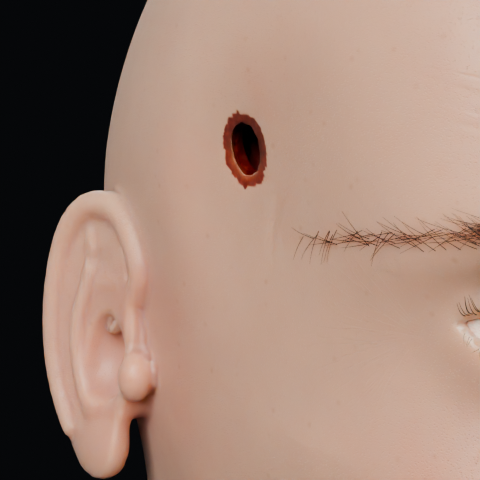 | 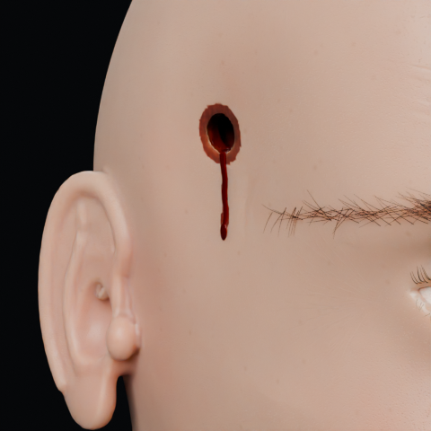 | 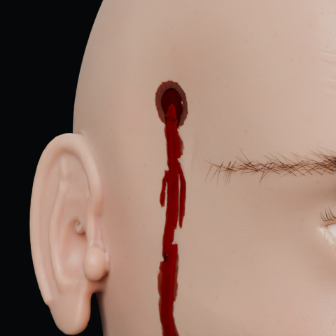 | 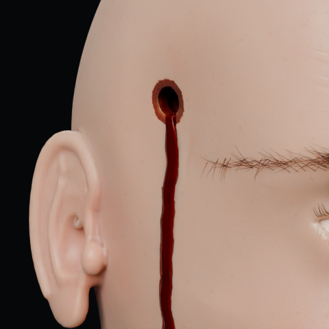 | 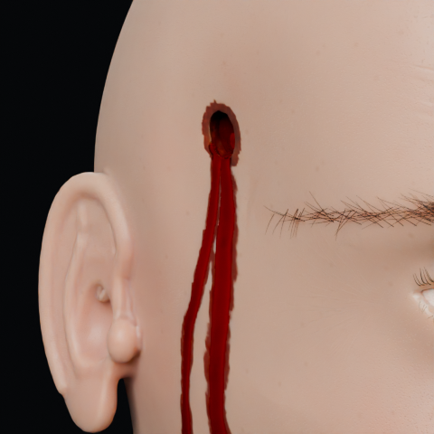 | 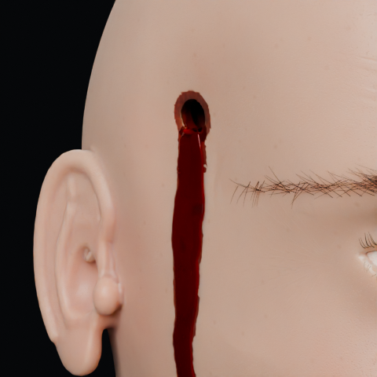 |
| 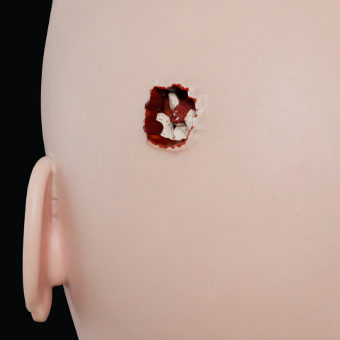 | 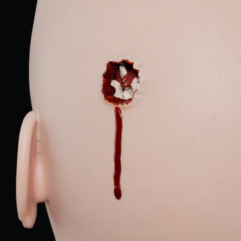 | 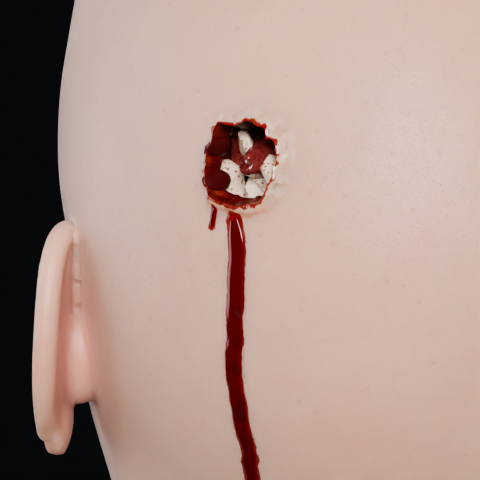 | 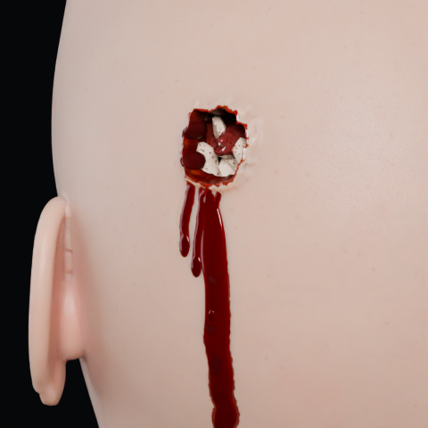 | 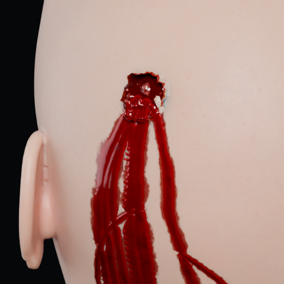 |  |

## Close-ups

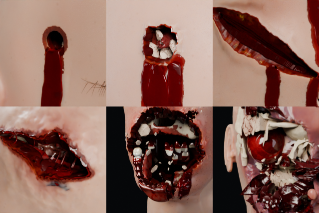
*Top: bullet entry, bullet exit, cheek slash. Bottom: scalp split (blunt), blast, crushed (repeated blows).*

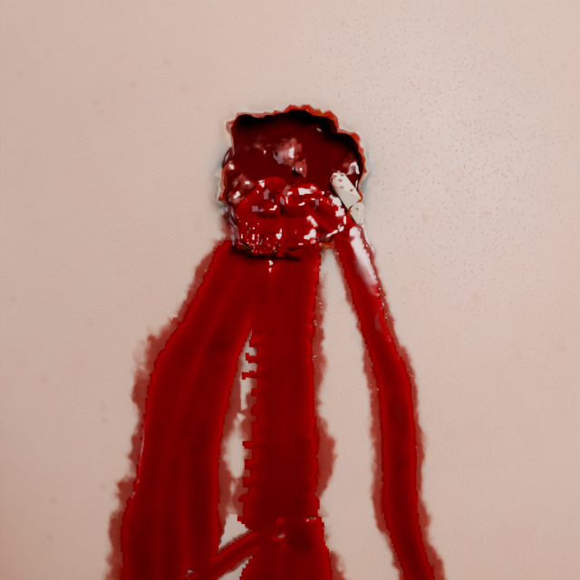

---

## Presets

`build.py` defines these (the `PRESETS` table). `build.apply_preset(name)` replaces all hits and sets the sliders.

| Preset | What it shows | Renders |
|---|---|---|
| `intact` | no wounds | `preset_intact_front/three_q.png` |
| `gunshot` | 9 mm through the right temple, exit at the back left; bleed 0.85 | `preset_gunshot_front/three_q/back.png` |
| `slash` | deep cut down the right cheek, shallow cut across the forehead | `preset_slash_*.png` |
| `blunt` | split lower lip with knocked-out teeth, burst scalp over a depressed fracture, ~3 h old | `preset_blunt_*.png` |
| `burn` | large burn over the right half of the face and jaw, ~1 h old | `preset_burn_*.png` |
| `carnage` | 2 gunshots (entries and exits), 3 cuts including the throat, a smashed mouth, a burned cheek | `preset_carnage_*.png`, `hero.png` |
| `blast` | explosive in the open mouth: shredded lower-mid face, mandible segment hanging out with its teeth | `preset_blast_*.png` |
| `crushed` | four heavy blows to the right mid-face: caved-in cheek and orbit, torn flaps, bone plates, sunken eye | `preset_crushed_*.png` |

---

## Rebuilding

The scripts run either with the `bpy` Python module (`pip install bpy`, Python 3.11) or inside Blender. Run them from
this folder. All paths are relative to the script.

```
python3 build.py                          # full build: verify, all renders, save gore_head.blend
python3 build.py --no-render              # build + verify + save only
blender -b --python build.py -- --no-render            # the same inside Blender 5.1 (options after "--")
blender -b --python build.py -- --preset carnage       # save with 'carnage' active, render only its views
```

`build.py` options:

| Option | Meaning |
|---|---|
| `--preset NAME` | preset active in the saved file (default `gunshot`); also limits the preset renders to it |
| `--no-render` | build, verify and save only |
| `--out FILE` | .blend path (default `gore_head.blend` here) |
| `--samples N`, `--res N` | Cycles samples (default 40, denoised) and square resolution (default 640) |
| `--only A,B` | render only these: preset names, `cutaway`, `closeup_exit`, `sequence`, `contact_sheet`, `hero`, `stages` |
| `--render-dir D` | where the PNGs go (default `renders/`) |
| `--force` | render and save even if verification fails (exit code is still 1) |

The build runs `verify()` and `gore.verify_gore()`. If a check fails, it does not save and exits with code 1. The checks
include:
- every preset opens wounds and writes every `gore_*` attribute;
- `damage = 0` (and animation frame 1) gives exactly the intact mesh;
- burned eyebrow hairs disappear;
- moving / rotating / scaling a hit changes the mesh;
- no blood on intact skin at `drip_time = 0`, and blood grows with time;
- `bleed = 0` removes all blood;
- fewer than 5 % of wound-wall edges fold by more than 60 degrees (the anti-stripe check).

The 30 anatomy overlap checks run in `python3 anatomy.py`.

Module self-tests (each writes its own look-dev renders):

```
python3 anatomy.py                 # anatomy layers + overlap report  -> renders/anatomy_*.png
python3 materials.py --samples 32  # material look-dev                -> renders/materials_*.png
python3 gore.py [--no-render]      # gore system + verify_gore        -> renders/gore_*.png
```

`hero.png` is 1024 x 1024 at 96 samples. `stages.png` is composed with numpy from the four three-quarter preset renders.

---

## Files

| File | Contents |
|---|---|
| `CONTRACT.md` | the module contract: names, units, landmarks, hit semantics, attributes, controls, materials |
| `gh_common.py` | scene reset, collections, the `GH_Controls` sliders, drivers, stage lights, render helpers |
| `anatomy.py` | numpy signed-distance-field anatomy -> surface-nets mesh -> remesh -> snapped to the exact surface |
| `materials.py` | procedural Cycles materials (skin SSS, fat, muscle, bone, brain, blood, eye, teeth ...) |
| `gore.py` | the `GH_Gore` geometry-nodes system, `add_hit` / `add_hits` / `clear_hits`, `verify_gore` |
| `build.py` | integration: builds everything, hair, presets, cameras, verification, renders, saves the .blend |
| `FACE_FEEDBACK.md` | the user's feedback on the face (partly applied, see below) |
| `gore_head.blend` | the saved scene (gunshot preset, animated) |
| `renders/` | `hero`, `stages`, `preset_*`, `cutaway`, `closeup_exit`, `contact_sheet_wounds`, `seq_entry_*` / `seq_exit_*`, and the module look-dev renders `anatomy_*`, `materials_*`, `gore_*` |

---

## Performance (4-core CPU, no GPU; measured in the build that made these renders)

Measured on 2026-09-27 in a clean `python3 build.py` run (bpy 5.0.1 module, 4 CPU cores, no GPU):

| Step | Time |
|---|---|
| Build (anatomy 41.8 s, materials 6.7 s, gore 31.5 s, hair 0.3 s) | 80 s |
| Verification (`verify()` + `gore.verify_gore()`, applies every preset) | ~5 min |
| Evaluate all layers per preset | gunshot 3.4 s, slash 2.6 s, blunt 4.5 s, burn 4.1 s, carnage 9.9 s, blast 6.0 s, crushed 14.8 s |
| One 640 px preset render (40 samples, denoised) | 84-232 s |
| Exit close-up 640 px | 442 s |
| Blood sequence frame 480 px | 129-325 s |
| `hero.png` 1024 px, 96 samples | 716 s |
| All renders | 6089 s (~1 h 41 min) |
| Whole `python3 build.py` | 6576 s (~1 h 50 min) |
| `python3 build.py --no-render` | ~7 min |

The saved `gore_head.blend` is ~30 MB. On a machine with a GPU that Cycles can use, renders are far faster.

Live editing is **not** interactive. Every change to an empty re-evaluates all 12 gore layers. Expect ~2-3 s
for one hit, ~6-8 s for the carnage preset, and tens of seconds with 20+ large hits. Set **Viewport Detail** to
0-1 while placing wounds.

---

## Known limitations (honest list)

Checked against the forensic references (REFERENCE_NOTES §5.18) in the final build. It is **not** at the reference
level yet:

- **Blood amount (fails §5.18 G)**: runs start inside the wound and pour over the lowest rim point with no gap
  (§5.17 passes), and they grow over time. But each wound sheds only 1-4 separate ribbons. There are no merged sheets,
  no fine mist speckle, no pooling in hollows, no pendant drops off the chin or earlobe, and no floor pool. The blood
  also reads as glossy red ribbons at close range. Real head wounds are far bloodier.
- **Mush and colour (fails §5.18 A-C for the big wounds)**: the blast and crushed wounds have torn flaps, bone chips,
  clots and a broken jaw, but the bone plates read as clean pale paper-like sheets. The pulp is dark red glass rather
  than wet lumpy tissue with 4+ colours and scattered small highlights. Exit bone chips are clean white wedges.
- **Crushed silhouette (§5.18 D, partial)**: the mid-face caves in, but the change in outline is modest. A globe in
  a crushed orbit reads as a red ball, because the whole sclera fills with haemorrhage.
- **Entrance wound**: the right size (scalp ~7.5 mm), but the even brown abrasion collar still reads a little like a
  ring decal in close-ups.
- **Slash**: the deep cheek cut reads like a "second mouth" from three-quarter view. The throat cut shows no muscle
  bundles, vessel openings or airway ring on its cut face.
- **Blunt**: no inner-lip (vestibule) laceration. Knocked-out teeth are hard to see from the front.
- **Burn**: no ruptured blister flaps, and no eyelid or lip pulled out of shape. The burned eye shows a clean globe.
  The zone ends in a near-vertical line beside the nose in the front view.
- **Face likeness**: the head still reads as a smooth mannequin: soft features, a plain neck and clay-like ears.
  `FACE_FEEDBACK.md` is only partly applied.
- **Cutaway**: the brain's cut face reads as marble or cauliflower, and the tongue is still slab-like.
- **Timing**: `wound_age` is one global slider, so wounds cannot age separately.
- **Speed**: see *Performance*. There is no per-layer hit culling, so dragging an empty is not interactive.
- **Not yet run on Blender 5.1**: only the `bpy` 5.0.1 module has run these scripts. Run
  `blender -b --python build.py -- --no-render` first on a new machine.
